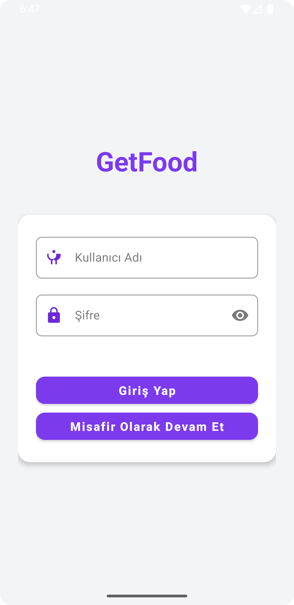
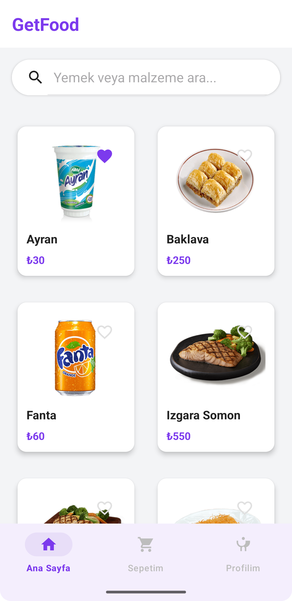
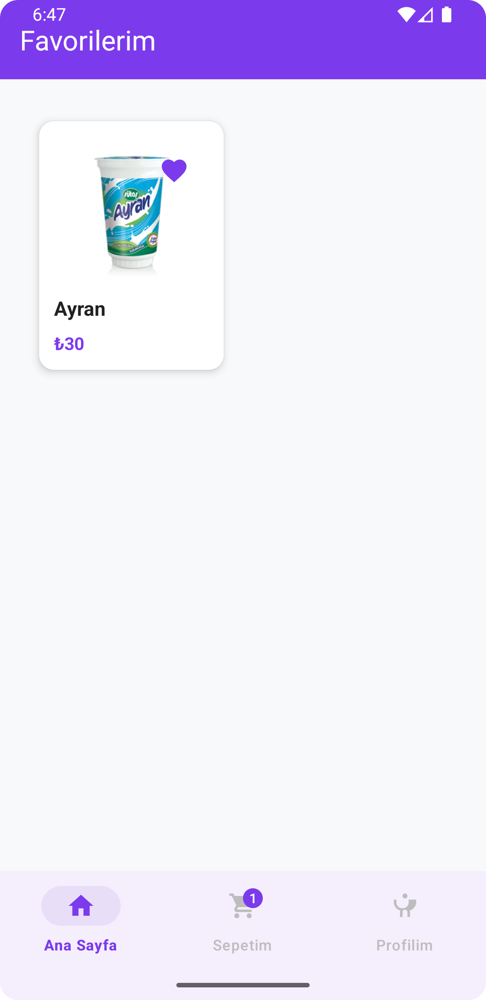
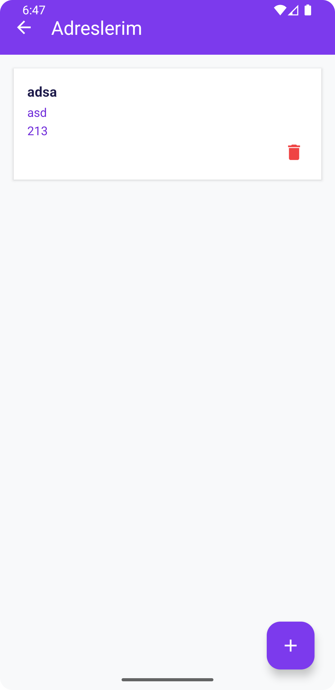
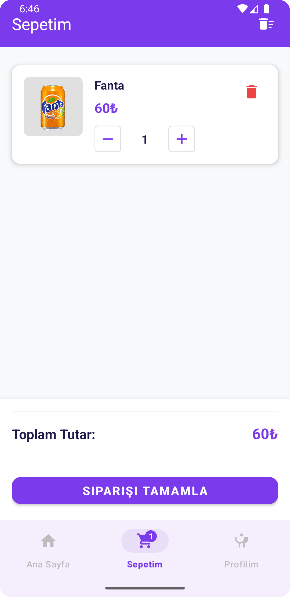
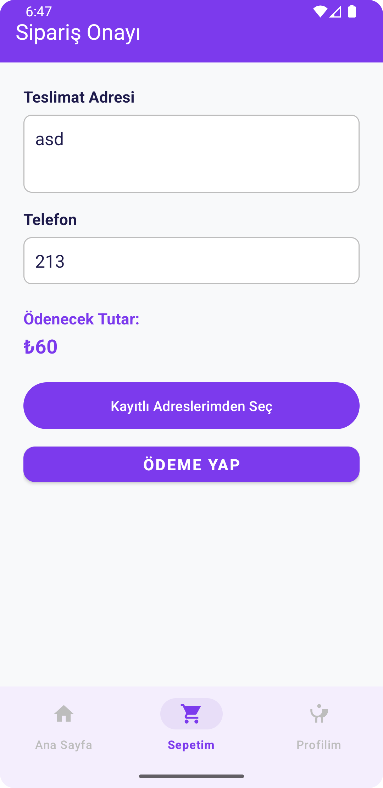
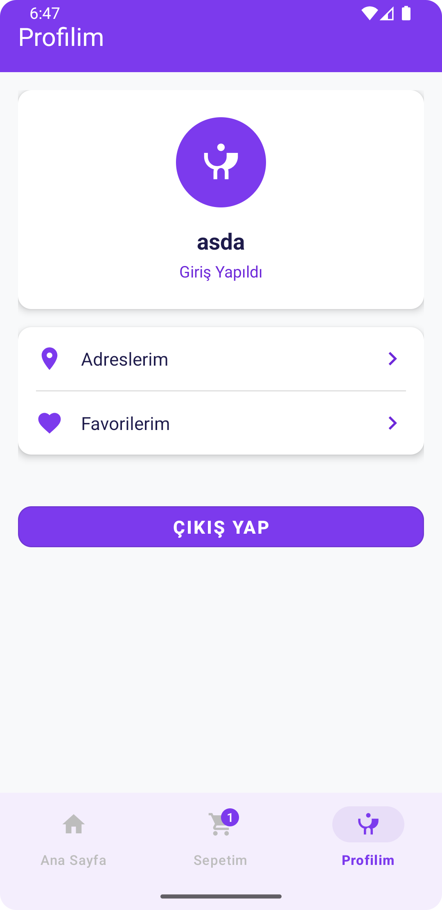

# Bitirme Projesi - GetFood 🍔

Modern Yemek Sipariş Uygulaması

---


## Proje Hakkında

**GetFood**, kullanıcıların çeşitli yemekleri keşfedip, favorilerine ekleyip, sepetine atıp kolayca sipariş verebildiği modern ve kullanıcı dostu bir Android uygulamasıdır. Tasarımda Getir uygulamasından ilham alınmış, canlı mor tema ve sade arayüz ile geliştirilmiştir.

- **Proje Adı (GitHub):** Bitirme-Projesi
- **Platform:** Android (Kotlin)
- **Mimari:** MVVM (ViewModel sınıfı olmadan, sade MVVM)
- **API:** [Kasim Adalan Yemekler API](http://kasimadalan.pe.hu/yemekler/)

---

## Özellikler

- 🍽️ Yemekleri listeleme ve detaylarını görüntüleme
- 🛒 Sepete ürün ekleme, adet değiştirme, sepeti temizleme
- ❤️ Favorilere ekleme/çıkarma
- 📦 Sipariş tamamlama ve ödeme ekranı
- 📍 Adres yönetimi (adres ekle, sil, seç)
- 👤 Kullanıcı girişi ve misafir modu
- 🔔 Sepet badge güncelleme
- Modern mor tema ve Getir tarzı UI

---

## Ekranlar

| Giriş | Ana Sayfa | Favoriler | Adresler | Sepet | Ödeme | Profil |
|-------|-----------|-----------|----------|-------|-------|--------|
|  |  |  |  |  |  |  |

---

## Kullanılan Teknolojiler

- **Kotlin**
- **Retrofit & Gson** (API ve JSON işlemleri)
- **Kotlin Coroutines** (asenkron işlemler)
- **Glide** (görsel yükleme)
- **SharedPreferences** (lokal veri saklama)
- **Material Components** (modern UI)

---

## Kurulum

1. Bu repoyu klonla:
   ```bash
   git clone https://github.com/vamos99/Bitirme-Projesi.git
   ```
2. Android Studio ile aç.
3. Gerekirse `local.properties` dosyasını oluştur (otomatik oluşur).
4. **Build > Clean Project** ve ardından **Run** ile uygulamayı başlat.

> Not: API anahtarı gerektirmez, doğrudan çalışır.

---

## Proje Kuralları & Mimarisi

- MVVM mimarisi (ViewModel sınıfı olmadan, sade)
- Tüm API isteklerinde kullanıcı adı: `halil_kiyak`
- Navigation: Standart Intent ile
- Jetpack ViewModel, LiveData, Navigation Component **KULLANILMAZ**
- Kodda gereksiz log/debug yok, sade ve okunaklı
- Tüm renkler modern mor temaya uygun

---

## Katkı Sağlamak

1. Forkla & yeni bir branch oluştur
2. Geliştirmeni yap
3. Pull Request gönder

---

## Lisans

MIT

---

**Vamos99 / Bitirme Projesi - GetFood**

> Modern, sade ve işlevsel bir yemek sipariş deneyimi! 